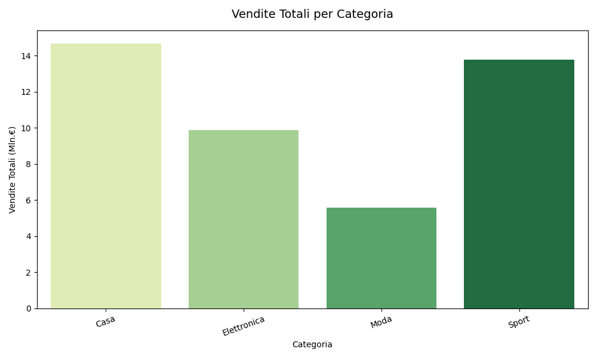

# Analisi Dati - merge da fonti multiple (CSV,JSON,SQL)

Questo repository contiene un esercizio demo in Python per la creazione, il merge e l'ottimizzazione di dataset con `pandas` e `numpy`.

## Contenuto principale

- `Main.py` lo script principale:
  - genera dataset locali sintetici per `ordini`, `prodotti` e `clienti`
  - salva i file come `ordini.csv`, `prodotti.json` e `clienti.csv`
  - effettua il merge dei dataset in un unico `DataFrame`
  - esegue ottimizzazioni dei tipi di dato per ridurre l'uso di memoria
  - aggiunge colonne calcolate e applica filtri sui dati
  - crea due visualizzazioni con `seaborn` e `matplotlib`

## Obiettivo dell'esercizio

L'obiettivo è dimostrare una pipeline di analisi dati semplice che include:

- generazione di dataset sintetici
- importazione e **unione di file CSV/JSON** (si può aggiungere anche SQL)
- ottimizzazione dei tipi di dati (`integer`, `category`, `float64`)
- calcolo di metriche e filtri
- visualizzazione dei risultati con grafici

## Immagini e grafici

Nella cartella `images` sono presenti due immagini di esempio generate dal codice:

- 
- 

## Esecuzione

Per eseguire il demo:

```bash
python Main.py
```

Assicurati di avere installato i pacchetti richiesti:

```bash
pip install pandas numpy seaborn matplotlib
```

## Risultati attesi

Lo script stampa il confronto memoria prima/dopo l'ottimizzazione e mostra:

- un grafico a barre delle vendite totali per categoria
- un donut chart della distribuzione dei clienti per segmento
